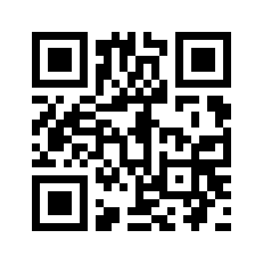

# DeviceKanriSan
端末管理するやつ

# 注意事項
**このままではビルドできません!!**
GASのURLを記載する必要があります。具体的には`ApiModules.kt`以下の部分

```kotlin:
    @Provides
    fun provideRetrofitBuilder(): Retrofit.Builder {
        return createRetrofitBuilder("https://script.google.com/macros/s/XXXXXXXXXXXXXXXXXXX/")
    }
```

同様の理由により、SwaggerAPIも追加する必要があります。
これはサンプルを[Gistに公開](https://gist.github.com/kiuchikeisuke/7b7f38867231c748c81bc8cb377a27ec)してあるのでそちらを参考にdevice-kanri-api.jar的なやつを作ってください
作成したらそれを`app/libs`の中に放り込めばOKです。
なお、ビルド時に指定するオプション指定は以下の通り.RxJava2とRetrofit2が必須です
```json
{
  "groupId":"your.group.id",
  "artifactId":"device-kanri-api",
  "artifactVersion":"1.0.0",
  "useRxJava2":"true",
  "library":"retrofit2"
}
```

## サービスの仕様について
- レンタルは**一律７日間**で貸し出し
- **レンタル期間をすぎると１時間ごとにBOTがメール通知を行います**
- 日付を変えたい場合は`src/~/domain/RentalDevice`で指定してるので任意に変更で。

# 機能概要
- このアプリはMasterとSlaveの２タイプあります。
- Slaveは現在の端末一覧を確認できます。
- Masterは上記の機能に加えて貸し出し・返却処理ができます。
- Masterをインストールするアプリは端末置き場の近くに置き、貸し出し機として利用してください
- Masterアプリは**基本配布禁止です(自席で貸し出し処理をできないようにするため)**

# QRコード読み込みについて
## 社員証のQRコード読み込み
社員証の裏にあるQRコードを読み込ませてください。端末によっては読み込みづらい場合があります

## 端末のQRコード読み込み
### 端末用のQRコード作成
まず、貸し出し可能な端末には以下のルールに則ったQRコードを貼り付けてください。

`デバイス名 , デバイスId`

- デバイス名は各デバイスが識別できる任意の文字列でOKです
 - 例:Galaxy Nexus 7 (OS:5.1.1)
- デバイスIdは各デバイスを判定するための、一意に定まる数字を指定してください(**重複はNGです**)
 - 例:12
- デバイス名とデバイスIdは「,」(半角カンマ)で区切ってください

上記の例を当てはめると、以下のようなデータでQRコードができます

`Galaxy Nexus 7 (OS:5.1.1)  , 12`



### 端末のQRコード読み込み
貸し出し・返却時には端末に貼り付けてあるQRコードを読み込ませてください。端末によっては読み込みづらい場合があります。

# 開発者向けのアレコレ
- サーバーはGoogleActionScriptでできてます。現在は開発者だけが見れます
- 端末管理表はGoogleSpreadSheetでできてます。現在は開発者だけが見れます
- **iOSアプリを誰か作って欲しいです**
